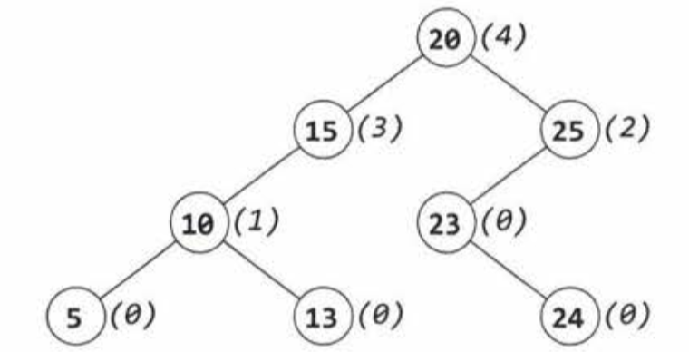

# Rank from Stream

Imagine you are reading in a stream of integers. Periodically, you wish to be able to look up the rank of a number x(the number of values less than or equal to x).

Implement the data structures and algorithms to support these operations.

track(int x): called when each number is generated

getRankOfNumber(int x): returns the number of values less than or equal to x(not including x itslef).

Example:

Stream: 5, 1, 4, 4, 5, 9, 7, 13, 3

getRankOfNUmber(1) = 0

getRankOfNumber(3) = 1

getRankOfNumber(4) = 3

Example:



rankOfElement(24):

24 > 20, 24 is on its right, 24 must be larger than 20's left subtree and 20 itself. 1 + weight(20).

24 < 25, 24 is on its left, so it doesn't do anything.

24 < 23, 24 is on its right, so 1 + weight(23) = 1


## Solution 1:

```java
public class Solution {
    RankNode root = null;
    /** Insert given number to bst. */
    public void track(int number) {
        if (root == null) root = new RankNode(number);
        root.insert(number);
    }

    /* Return rank of given number.
     * rank: the smallest has rank 1, and so on. */
    public int getRankOfNumber(int number) {
        return root.getRank(number);
    }

    private class RankNode {
        public int left_size = 0;   // number of nodes in its left sub tree.
        public RankNode left, right;
        public int data = 0;

        /* Constructor */
        public RankNode(int d) { data = d;}
        /* Insert value into bst. */
        public void insert(int d) {
            if (d <= data) {
                if (left != null) left.insert(d);
                else left = new RankNode(d);
                left_size++;
            } else {
                if (right != null) right.insert(d);
                else right = new RankNode(d);
            }
        }
        /* Get rank: number of elements < given value */
        public int getRank(int d) {
            if (d == data) {
                return left_size;
            } 
            else if (d < data) {
                if (left == null) return -1;
                else return left.getRank(d);
            }
            else {
                if (right == null) return -1;
                int right_rank = right.getRank(d);
                return left_size + 1 + right_rank;
            }
        }
    }
}
```