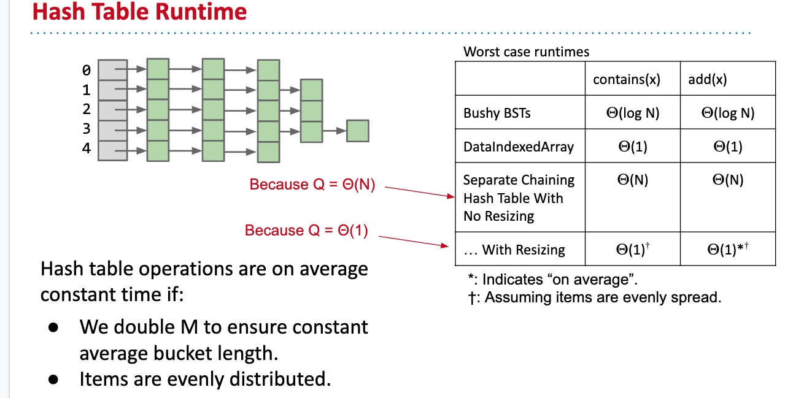

# Hash Tables:

## Handling Collisions

Suppose N items have the same numerical representation h:

+ Instead of storing true in position h, store a "bucket" of these N items at position h.

How to implement a "bucket"?

Use linkedlist, arraylist or whatever.

---

## The Spearate Chaining Data Indexed Array

Each bucket in our Array is initially empty. When an item x gets added at index h:

+ If bucket h is empty, create a new list containing x and store it at index h.
+ If bucket h is already a list, we add x to this list if it is not already present.


---

## Hash Table


---

## Hash Table Runtime

Q: length of longest list

contains(x) : Theta(Q)

add(x)      : Theta(Q)


If we have N items, 5 buckets, what is the runtime of Q in terms of N.

Best case: N/5, Worst case: N.

## N items, M buckets

How do we design to make N/M is Theta(1)

We have a load factor N/M >= 1.5, then double M.



## Regarding Even Distribution

Even distribution of item is critical for good hash table performance.

## Hash Table in Java

java.util.HashMap and java.util.HashSet

All objects in Java must implement a `.hashcode()` method.


## Important Warnings when using HashMaps/HashSets

Never store objects that can change in HashSet or HashMap.

Never override equals without also overriding hashCode.

---

## Example HashCode Function

Java 8 hashcode function for strings.

+ use base 31
+ cache calculated hash code

```java
@Override
public int hashCode() {
    int h = cachedHashValue;
    if (h == 0; this.length() > 0) {
        for (int i = 0; i < this.length(); i++) {
            h = 31 * h + this.charAt(i);
        }
        cachedHashValue = h;
    }
    return h;
}
```

Java's hashcode() function for Strings:

h(s) = a * 31^n-1 + b * 31^n-2 + ... + z * 31^0

Use a prime.