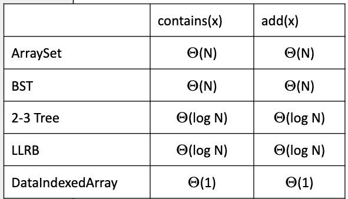
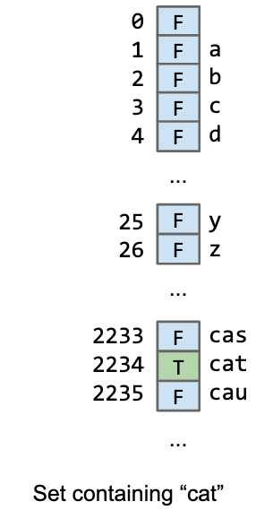

# Hashing

## Data Indexed Arrays

Our extreme approach, Create an array of booleans indexed by data.

+ Initially all values are false.
+ When an item is added, set appropriate index to true.

```java
DataIndexedIntegerSet diis;
diis = new DataIndexedIntegerSet;
diis.add(0);
diis.add(5);
diis.add(10);
diis.add(11);
```

```
0   T
1   F
2   F
3   F
4   F
5   T
6   F
7   F
8   F
9   F
10  T
11  T
12  F
```

Its implementation

```java
public class DataIndexedIntegerSet {
    private boolean[] present;

    public DataIndexedIntegerSet() {
        present = new boolean[2000000];
    }

    public void add(int i) {
        present[i] = true;
    }

    public boolean contains(int i) {
        return present[i];
    }
}
```



---

## Generalizing the DataIndexdIntegerSet Idea

How do we get a data indexed set that can store arbitrary data types.

How to store Strings???

Suppose we want to add ("cat")

The key question:

What is the catth element of a list?

One idea is:

a = 1, b = 2, c = 3,....

But What about other words that start with c.

contains("chupacabra"): true


---

## How to avoid collisons?

a = 1, b = 2, c = 3, ..., z = 26.

Index of "cat" = (3 * 27^2 + 1 * 27^1 + 20 * 27^0) = 2234

---

## How to understand this?

In the decimal system, we have 10 digits: 0,1,2,3,4,5,6,7,8,9

Want larger number than 9???

7091 = 7000 + 0*100 + 9 *10 + 1 * 1

---

bee in base 27 = 2 * 27^2 + 5 * 27 + 5 * 1 = 1598

## Implement englishToInt

Write a function englishToInt that can convert English strings to integers by adding characters scaled by powers of 27.

a:1, z:26, bee:1598, aa: 28

```java
/** Converts ith character of String to a letter number. */
public int letterNum(String s, int i) {
    char ithChar = s.charAt(i);
    if ((ithChar < 'a') || (ithChar > 'z')) {
        throw new IllegalArgumentException();
    }
    return ithChar - 'a' + 1;
}

public int englishToInt(String s) {
    int intRep = 0;
    // cool trick here
    for (int i = 0; i < s.length(); i++) {
        intRep = intRep * 27;
        intRep = intRep + letterNum(s, i);
    }
    return intRep;
}
```

---

## Implementation for DataIndexedEnglishWordSet implementation

```java
public class DataIndexedEnglishWordSet {
    private boolean[] present;

    public DataIndexedEnglishWordSet() {
        present = new boolean[200000];
    }

    public void add(String s) {
        present[englishToInt(s)] = true;
    }

    public boolean contains(int i) {
        return present[englishToInt(s)];
    }
}
```



---

What if we are in ASCII.

Example:


```java
public static int asciiToInt(String s) {
    int intRep = 0;
    for (int i = 0; i < s.length(); i++) {
        intRep = intRep * 126;
        intRep = intRep + s.charAt(i);
    }
    return intRep;
}
```