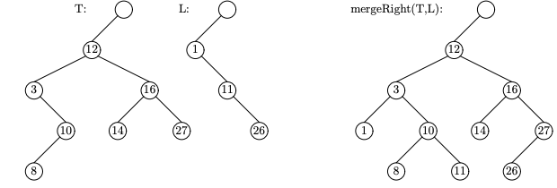

# C level

### 1. What is the best case BST height in terms of N? Worst case?

Best case: log(N), bushy tree all the way.

Worst case: N,  basically a linked list.

### 2. If shuffling yields logN tree height, why don't we simply shuffle
our input data before building our BST?

Because we don't always get all the data at once. We get data in time.

### 3. Give two orderings of [A,X,C,S,E,R,H] that, when inserted into an empty BST, yield the best case height, draw the tree.

The sorted would be [A,C,E,H,R,S,X].

```
        H
     C     S    
   A   E R   X
```

Insertion order: 

                 h,c,s,a,e,r,x

                 h,c,a,e,s,r,x
                 
                 h,c,e,a,s,x,r
                 
### 4. Delete the root of tree in #3. Follow the algorithm from BSTMap.

1) If left side or right side is null, just return the other side.

2) We need to find the smallest element in the right side. R

    R would be larger than all in the left, smaller than all in the right. 

3) Delete A from right side,  make R the new root.
          
            R
         C    S
       A   E    X
       

# B level

### 1. Suppose that a certain BST has keys that are integers between 1 and 10, and we search for 5. What sequence of keys below are possible during the search for 5?

    a. 10,9,8,7,6,5
    b. 4,10,8,7,5,3
    c. 1,10,2,9,3,8,4,7,6,5
    d. 2,7,3,8,4,5
    e. 1,2,10,4,8,5

d is not possible, 7<8

### 2. Is the delete operation commutative? 

No it isn't.

```
     a                     c                     c
  b     d   delete A     b   d    delete B         d
      c

            delete B       a       delete A       d
                               d                c
                             c
```

The fundamental truth is for 1,2:

```

    1,2  gives us   1     ,   2,1    gives    2
                      2                     1

```

### 3. A complete bst with 2^n-1 nodes, we can perform searches in theta(logn) time. All nodes in such trees have either zero or two non-null children. In contrast, in a bst where every node has either 0 or one children, searches take theta(n) time. Suppose that you have a general bst in which every node has either 0 or 2 children. What is the worst search time in that case? what do worst case look like?

Worst case would look like this:

```
      a
    b    c
       d   e
         f   g
           h   i

```

A right-leaning tree, basically the height will be N/2, Theta(n).

### 4. Some Tree questions

a) delete 7 from this tree.

```
        7
     5     8
  1           12
    3      10
   2        11
```

replace 7 with the smallest element from the right side.

```
        8
    5       12
  1       10
    3      11  
   2 
```

b) Give an example of a rotation operation on the original tree that would increase the height.

# A level

Given the following definition:

```java
public class IntTree {
    public IntTree(int data, IntTree left, IntTree right) {
        this.data = data; this.left = left; this.right = right;
}
    public final int data;
    public IntTree left, right;
}
```

Define a destructive `mergeRight` routine that combines the values in two search trees.
The trees are bst with a sentinel node(whose data field is irrelevant) at their root.
The sentinel's left child is the tree containing the data in each case.



```java
/** Assuming that T and L are binary search trees with a single sentinel tree node, 
* and that all left children is L aside from the sentinel are empty(L is right-leaning),
* returns a bst containing the original elements of T and L.
# The operation is destructive. It takes linear time in worst case.
*/
public class MergeRight {
    public static IntTree mergeRight (IntTree T, IntTree L) {
        T.left = mergeRight(T.left, Integer.MAX_VALUE, L);
    }
    
    private static IntTree mergeRight (IntTree T, int next, IntTree L) {
        if (L.left == null) return T;
        if (T == null) {
            if (L.left.data <= next) {
                IntList p = L.left;
                L.left = L.left.right;
                p.right = mergeRight(nil, next, L);
                return p;
            }
        } else {
            if (L.left.data <= T.data) {
                T.left = mergeRight(T.left, T.data, L);
                }
            if (L.left != null && L.left.data > T.data) {
                T.right = mergeRight(T.right, next, L)}     
            return T;  
    }
    }

}

```


