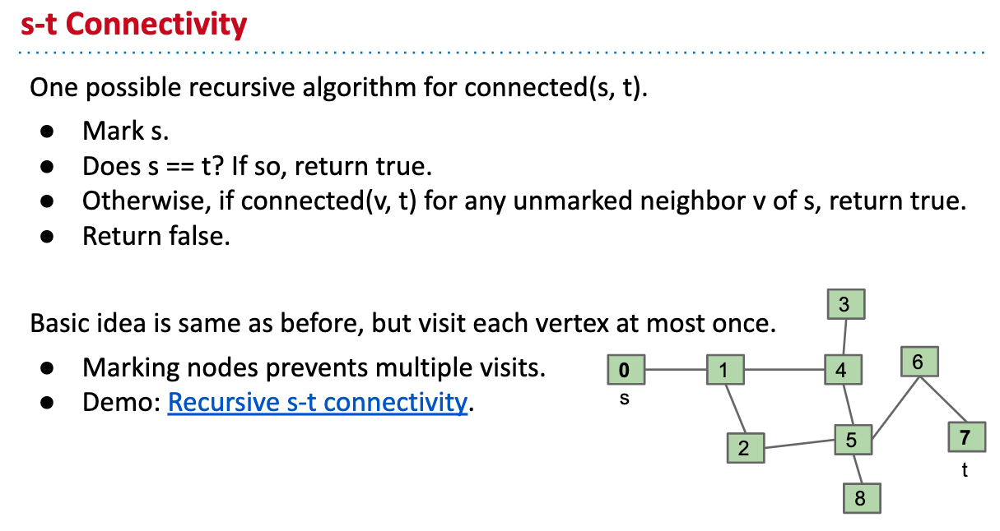

# Graph Traversal

## s-t Connectivity

One possible recursive algorithm for connected(s,t):

+ Mark s. (we mark all the vertices that has been visited)
+ Does s == t ? if so, return true.
+ Otherwise, if connected(v, t) for any unmarked neighbor v of s, return true.
+ Return false.

[demo](https://docs.google.com/presentation/d/1OHRI7Q_f8hlwjRJc8NPBUc1cMu5KhINH1xGXWDfs_dA/edit)

---

## Depth First Traversal

The idea of exploring a neighbor's entire subgraph before moving on to the next neighbor is known as Depth first traversal.

Example of usage:

+ Computes a path to every vertex.

[demo](https://docs.google.com/presentation/d/1lTo8LZUGi3XQ1VlOmBUF9KkJTW_JWsw_DOPq8VBiI3A/edit#slide=id.g76e0dad85_2_380)

## Graph Traversal vs Tree Traversal

Graph traversals:

+ DFS preorder, DFS postorder
+ BFS

