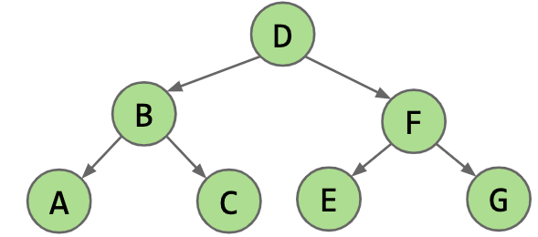

# Preorder



Preorder: "Visit" a node, then traverse its children:

D B A C F E G

    ```java
    preOrder(BSTNode x) {
        if (x == null) return;
        print(x.key);   // Visit a node first
        // Then visit its children
        preOrder(x.left);
        preOrder(x.right);
    }
    ```

Pre: "Visit" a node first.

## Solution 1: Recursion

```java
public List<Integer> preorder(TreeNode root) {
    List<Integer> result = new ArrayList<>();

    if(x == null) return;
    result.add(root.val);
    preorder(x.left);
    preorder(x.right);
}
```

## Solution 2: Iteration

```java
public List<Integer> preorder(TreeNode root) {
    Stack<TreeNode> stack = new Stack<>(); 
    List<Integer> result = new ArrayList<>();
    
    stack.push(root);

    while (!stack.isEmpty()) {
        TreeNode node = stack.pop();
        if (node != null) {
            result.add(node.val);
            stack.push(node.right);
            stack.push(node.left);
        }
    }
    return result;
}
```

Another version

```java
public List<Integer> preorder(TreeNode root) {
    Dequeue<TreeNode> stack = new ArrayDeque<>();
    List<Integer> result = new ArrayList<>();

    if (root == null) return result;
    // .add(E e) insert e into the tail of the deque. same as .push()
    stack.add(root);

    while (!stack.isEmpty()) {
        // Retrieves and removes the last element of this deque. same as .pop()
        TreeNode node = stack.pollLast();
        result.add(node.val);

        if (node.right != null) stack.add(node.right);
        if (node.left != null) stack.add(node.left);
    }
    return result;
}
```